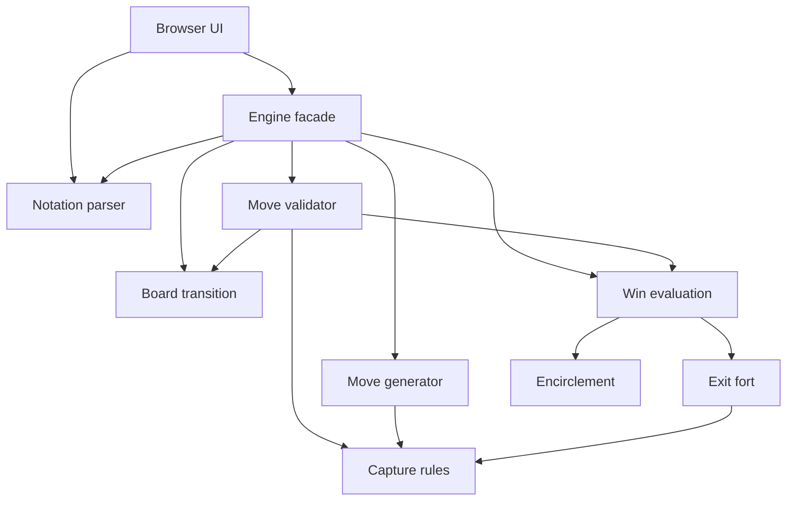

# Hnefatafl TypeScript project review

Reviewed September 5, 2026. Baseline: `7b6f3b32db076610712875c02d17a2bae5bf4047`, plus the existing uncommitted edit to `public/index.html` that removes the obsolete fort-detection warning.

Scope: architecture, code quality, modularity, defects, and improvement planning for the TypeScript repository at `C:/Users/david/source/Hnefatafl`. The Rust reference project was excluded. No implementation, configuration, dependencies, or existing tests were changed during this review. The production build regenerated ignored `dist` output.

## Assessment

The project has a sound foundation for its present size: a small stateful engine over synchronous board and rule functions, no production package dependencies, and no DOM or network dependencies in the engine. A framework rewrite or a large abstraction layer would offer little immediate benefit.

The principal weakness is inconsistent contracts between layers. Move generation, validation, application, parsing, and presentation each interpret part of a move independently. This creates observable disagreements even though the current suite passes. State ownership is also weaker than the engine's encapsulated design suggests.

The best first phase is to document current behavior, expand checks around public API boundaries, and make small extractions that preserve behavior. Correcting the defects below should be a separately selected phase because even a clear bug fix changes observable behavior.

## Verification and limits

| Check | Result |
| --- | --- |
| Existing Vitest suite | **238 passed**, seven test files |
| Project TypeScript check | **Passed**, using the current `tsconfig.json` |
| Vite production build | **Passed**, 15 transformed modules |
| Separate strict check of `vite.config.ts` | **Two errors**; see T1 |
| Browser smoke check of production build | Board loaded; opening move applied; incorrect history label and permissive notation loading confirmed |
| Targeted engine probes | Reproduced B1–B7 below without editing application files |

The local runtime was Node `v24.19.0`, with installed Vite `7.0.6` and Vitest `3.2.4`. Commands were the local executable equivalents of `npm test`, `npx tsc --noEmit`, and `npm run build`:

```text
node node_modules/vitest/vitest.mjs run
node node_modules/typescript/bin/tsc --noEmit
node node_modules/vite/bin/vite.js build
```

The sandbox initially prevented esbuild from reading the configuration; the same checks succeeded when run with the necessary filesystem access. That startup failure was environmental, not a project defect. Installed dependencies were used without a fresh install. CI under Node 18 was not executed, and no claim is made that its current build necessarily fails.

Review coverage included all 11 production TypeScript files, all seven test files, the browser UI, package/compiler/build configuration, deployment workflow, README, and fort documentation. The browser check was a smoke check, not exhaustive testing of every UI option or assistive technology. No code-coverage percentage or performance benchmark was collected. Rules were assessed against the repository's behavior, tests, and documentation; the Rust project and an external ruleset were not treated as authoritative.

## Current architecture

| Component | Current responsibility | Assessment |
| --- | --- | --- |
| `HnefataflEngine.ts` | Own state, parse/validate/apply commands, counters, history, turns | Useful facade; state ownership and transition responsibilities need tightening |
| `board.ts` | Layout parsing, initialization, cloning, movement, defender projection, edge extraction | Good location for board operations; production validation and flexible fixture construction are mixed |
| `validator.ts` | Movement legality, capture checks, repetition, result preview | Too much overlap with generation/application |
| `moveGenerator.ts` | Rook destinations and captures | Independently implements legality and lacks repetition context |
| `captures.ts` | Ordinary captures, king capture, shieldwalls, hostile squares | Valuable shared rule module; capture results need a defined uniqueness contract |
| `rules.ts` | Terminal-state evaluation and compatibility exports | Reasonably focused, but its post-move input contract is ambiguous |
| `exitFort.ts` | Structural attacker access and recursive defender removal | Complex but isolated and documented; reuses actual capture logic |
| `parser.ts`, `patterns.ts` | Move and sequence notation | Small, but parsing is permissive and inconsistent between entry points |
| `utils.ts` | Coordinates, encirclement, text rendering, fort re-export | Unrelated responsibilities obscure dependencies |
| `types.ts` | Domain and result types | Clear vocabulary; permits contradictory and mutable states |
| `public/index.html` | Styling, DOM, input state, board rendering, event handling, history | Nearly 800 lines; approximately 360 lines of unchecked inline JavaScript |

The important runtime paths are:



This shows why the facade can preview and then recompute a transition while the generator follows a different path. Actual imports also route captures through `rules.ts` and route fort detection through `utils.ts`; these compatibility exports add indirection even though the underlying implementation has been extracted.

Strengths worth retaining:

- The core runs synchronously and can be tested without a browser.
- `captures.ts` is shared by real moves and structural fort analysis.
- Fort evaluation works on copied squares, has an explicit termination argument, and is checked for non-mutation.
- The 172 fort tests include rotations/reflections of 21 scenarios and four attacker-relocation checks. This is particularly useful for directional board algorithms.
- CI already runs tests before building and limits deployment to `main`.
- A lockfile and strict TypeScript configuration are present.

## Confirmed defects

Priority here means order for a future corrective phase: **P1** affects core result/accounting consistency; **P2** affects normal API/UI correctness or state integrity; **P3** has narrower exposure. It does not indicate a production outage. All findings below have high confidence; reproduction scope is stated explicitly.

### B1 — P1: One captured piece can be counted twice

Evidence: [capture aggregation](../src/captures.ts#L48), [capture validation](../src/validator.ts#L101), [counter updates](../src/HnefataflEngine.ts#L101).

Ordinary and shieldwall captures are concatenated without deduplication. A piece satisfying both rules appears twice. On fixture A in the appendix, `D11-C11` produces two copies of `B11`, removes one defender, increments the defender-capture counter by **two**, and records `D11-C11(B11B11)`. Explicitly supplying the correct single square, `D11-C11(B11)`, is rejected because two entries are expected.

This is a defect regardless of whether the eventual ruleset allows single-piece shieldwalls: one physical piece cannot account for two captured pieces.

Future correction: define the capture result as unique coordinates and consume that result consistently in validation, counters, preview, and notation. Acceptance: fixture A returns `B11` once, counts one defender, and accepts single-square notation. Include overlap checks under rotation/reflection.

### B2 — P1: Validation can preview a different outcome from application

Evidence: [preview simulation](../src/validator.ts#L154), [application using expected captures](../src/HnefataflEngine.ts#L92).

The validator discovers `expectedCaptures`, but builds its preview with the caller's `move.captures`. The engine applies the discovered captures automatically. If capture notation is omitted, the preview leaves captured pieces on the board.

On fixture B, `validateMove('D6-E6')` reports `in_progress`, whereas `validateMove('D6-E6(F6)')` reports `attacker_win`. Applying the unannotated `D6-E6` also reports `attacker_win`. The extra defender at `B1` is important: it prevents encirclement from accidentally hiding the preview error.

Future correction: simulate and commit the same resolved move. Acceptance: explicit and automatic notation produce identical captures, resulting boards, and status. Add cases where captures affect fort or encirclement evaluation as well as king capture.

### B3 — P2: Move generation offers a repetition-forbidden move

Evidence: [engine move generation](../src/HnefataflEngine.ts#L189), [generator](../src/moveGenerator.ts#L26), [repetition check](../src/validator.ts#L139), [UI consumer](../public/index.html#L411).

`getPossibleMoves` does not pass defender history to the generator, and the generator never checks repetition. From a new standard game, apply:

```text
D11-D10, F8-E8, D10-C10
```

`getPossibleMoves({ x: 4, y: 3 })` includes `F8`, but `validateMove('E8-F8')` rejects it as a repeated defender position. The UI uses the generated list to indicate available destinations, so it can advertise a move that Apply rejects.

Future correction: explicitly separate geometric candidates from fully legal moves, then make the public/UI contract use the intended one. Acceptance: every advertised legal move validates against the same state and history. Preserve the repository's existing defender-only repetition rule unless separately changed.

### B4 — P2: Malformed capture text and sequence entries are silently discarded

Evidence: [capture extraction](../src/parser.ts#L14), [sequence parsing](../src/parser.ts#L28), [regex flags](../src/patterns.ts#L1), [history storage](../src/HnefataflEngine.ts#L149).

Capture parsing searches for matching substrings rather than consuming the entire capture section. Its regex is case-sensitive while the outer move regex is not. Reproduced results:

| Input | Observed result |
| --- | --- |
| `D11-D10(garbage)` | Parsed as a move with no explicit captures; engine accepts it from the standard position |
| `D11-D10(a1)` | Lowercase capture silently ignored |
| `D11-D10(A12)` | Out-of-range `A12` interpreted as `A1` |
| `D11-D10(A1junk)` | Trailing junk ignored |
| `D11-D10,garbage,P,F8-E8` | Sequence parser drops `garbage`, keeps `pass`, and returns the other moves |

The sequence parser uppercases input first, so capture handling also differs between parsing a move alone and parsing it in a sequence. Invalid text can be retained in engine history because application preserves the original input string. Browser loading confirmed that invalid sequence entries disappear without an error.

Future correction: normalize case once, require complete token consumption, return errors with the failed sequence index, and define canonical serialization. Acceptance: malformed inputs fail explicitly; equivalent case/spacing forms have consistent semantics; move serialization round-trips.

### B5 — P2: State exposure and shared piece objects undermine encapsulation

Evidence: [state getter](../src/HnefataflEngine.ts#L44), [counter mutation](../src/HnefataflEngine.ts#L101), [shallow clone](../src/board.ts#L3), [shared layout occupants](../src/board.ts#L138), [mutable piece type](../src/types.ts#L12).

Three related behaviors were reproduced:

- `getState()` returns the actual internal state, and successful application returns the newly installed internal state. Callers can change the board, turn, status, and history without validation.
- All pieces using the same layout-character mapping share a `Piece` object. In a standard position, the attackers at `D11` and `E11` have identical occupant references. Changing the first object's owner changes the second as well. `clonePosition()` also shares those occupant objects with its input.
- Saving `const before = engine.getState()` before fixture A's capture leaves `before.position` showing the old defender, but changes `before.captured.defender` to two. Application mutates the old counters before copying them into the new state.

Shared pieces are harmless while treated as immutable, but neither runtime access nor the types enforce that treatment. The current UI mostly reads the state, so the risk is greatest for future consumers, replay snapshots, and analysis code. Old-counter mutation occurs during normal application without a caller writing state.

Future correction: choose and document a state-ownership contract; use immutable piece values or independent objects, calculate counters locally, and expose protected/read-only state appropriately. A TypeScript `Readonly` annotation alone does not prevent mutation from the JavaScript UI. Acceptance: callers cannot accidentally alter engine state, and saved snapshots remain internally consistent. This changes API behavior and belongs in the corrective phase.

### B6 — P2: Public coordinates and custom board sizes are not validated consistently

Evidence: [generator source indexing](../src/moveGenerator.ts#L32), [validator indexing](../src/validator.ts#L48), [layout size validation](../src/board.ts#L92), [fixed coordinate conversion](../src/utils.ts#L84), [fixed notation range](../src/patterns.ts#L1).

`getPossibleMoves({ x: -1, y: 0 })`, `{ x: 0, y: 11 }`, and `{ x: 1.5, y: 0 }` throw TypeErrors on a standard board. The exported raw validator has the same unchecked indexing pattern. This is an API-boundary defect; the normal board-click path supplies valid integer coordinates.

There is also a size-contract mismatch. `reset` accepts square layouts of different sizes, while notation always uses 11 rows and columns A–K. After resetting to `['R...R','..A..','..K..','.....','R...R']`, `validateMove('C4-C3')` throws because row conversion indexes outside the accepted 5×5 board. Larger accepted layouts contain squares the string API cannot address.

Future correction: decide whether the public game engine supports only 11×11 boards or variable sizes, separately from flexible low-level test fixtures. Validate coordinates before indexing and either reject unsupported game layouts or make notation size-aware. Acceptance: malformed coordinates produce a defined result, and every accepted game layout has a coherent command API.

### B7 — P3: Initialization can accept two kings

Evidence: [uppercase/lowercase king mapping](../src/board.ts#L113), [king count](../src/board.ts#L158).

`initializeGame` counts only uppercase `K`, but transformation recognizes both `K` and `k`. A layout with one of each passes initialization and produces two kings. A lowercase-only king layout is rejected. Rules then make inconsistent assumptions about which king matters: capture detection checks for any king, while fort detection retains the last king found.

Future correction: apply one supported-character policy, transform consistently, and validate invariants on the resulting board. Acceptance: every accepted production layout has exactly one king. Unknown layout characters currently become empty squares; whether to reject them is a related policy decision, not a separately proven gameplay defect.

### B8 — P2: Move history assigns the wrong player to every move

Evidence: [history renderer](../public/index.html#L453), [engine initialization](../src/HnefataflEngine.ts#L35).

The engine starts with the attacker, but `renderMoveList` begins with `player = 'defender'`. In the production browser build, applying the opening `D11-D10` displayed **`D: D11-D10`**. Subsequent alternating labels are likewise inverted for ordinary engine history.

Future correction: derive history labels from the recorded starting side or explicit move metadata. Acceptance: the first standard-game move is labeled `A`, the second `D`, and imported sequences follow their documented starting-side convention.

## Tooling and maintainability deficiencies

### T1 — P2: Runtime and type-check coverage are inconsistent

Evidence: [CI runtime](../.github/workflows/deploy.yml#L32), [locked Vite engine requirement](../package-lock.json#L1277), [configuration shim](../vite.config.ts#L1), [TypeScript scope](../tsconfig.json#L12).

CI selects Node 18, while the locked Vite package declares `^20.19.0 || >=22.12.0`. The config patches `crypto.hash` to work around one compatibility issue, but that does not establish support for the rest of Vite on Node 18. The successful local Node 24 build does not validate the CI runtime.

The normal TypeScript check covers `src` and tests, excluding the Vite config and inline browser JavaScript. Checking the config separately reports:

1. `TS2322`: the assigned `crypto.hash` shim does not implement the declared overloads and input types.
2. `TS2769`: the `test` property is not recognized by `defineConfig` imported from `vite` with the current types.

Reproduction:

```text
node node_modules/typescript/bin/tsc --noEmit --target ES2020 --module ESNext --moduleResolution Bundler --strict --esModuleInterop --skipLibCheck vite.config.ts
```

Future improvement: choose a runtime satisfying the locked toolchain, align development/CI runtime declarations, use the appropriate typed test configuration, and add type-check scripts to CI. Include browser code after its extraction. Review removal of the crypto shim with the runtime change. These changes affect tooling and require validation even though they need not change game rules.

### A1 — Consolidate move responsibilities incrementally

The validator and generator duplicate ownership, path, and restricted-square checks. The generator already walks each unobstructed ray, then rechecks the path from the source for every destination. Application performs validation, then reconstructs the board and evaluates terminal state again.

Behavior-preserving opportunity: extract common coordinate/geometry predicates and remove demonstrably redundant path scans, with equivalence checks over representative boards. Keep geometric candidate generation distinct from history-sensitive legality.

Later corrective opportunity: introduce a resolved-move result that carries canonical captures and the evaluated post-move state. Share that result between preview and commit. This can address B1–B3, but it must not be disguised as a pure refactor because those corrections alter results.

### A2 — Extract the UI into checked modules

The inline script combines rendering, three modes of input handling, selection state, capture highlights, notation loading, modal handling, and clipboard operations. Manual and automatic paths duplicate both highlight and success/failure handling. DOM fields and `selectedFrom` can independently represent the selection.

Behavior-preserving opportunity: extract the script and styles, then separate board rendering, selection/highlighting, history rendering, and command handling into a few focused modules. Preserve the current mode precedence and event behavior during extraction; add browser checks before consolidating branches. No new UI framework is needed.

Lower-priority cleanup: `stringToCoord` is unused and incorrectly assumes two-character coordinates, and `public/main.js` is not referenced by the actual HTML entry. Remove these only after confirming their lack of callers. The unused coordinate helper is not the cause of a current rank-10/11 input failure.

Accessibility is also limited: board cells are click-only `div` elements without keyboard controls or coordinate labels; the modal lacks dialog semantics and focus management. Manual coordinate inputs offer another way to enter moves, but do not make the board accessible. Treat accessibility interaction changes as a later UI behavior phase.

### A3 — Make module boundaries match domain responsibilities

Move coordinate conversion into a focused notation/coordinate module, encirclement into its own rule module, and text rendering into a debug helper. Let internal consumers import capture and fort implementations directly. Existing compatibility exports can remain until consumers are deliberately migrated.

`edgeSquares` means both the physical perimeter and interior non-throne restricted escape squares. Shieldwall logic must explicitly filter out the latter. Distinguish physical edges from escape targets in names/types so future code cannot accidentally join them again. The existing shieldwall regression demonstrates why this distinction matters.

These are useful small extractions. There is no evidence that a plugin-based rules engine, dependency injection framework, or separate package per rule is currently warranted.

### A4 — Strengthen types around results and invariants

`ApplyMoveResult` permits `success: true` without `newState`, and failure without an error. A discriminated union would make successful and failed outcomes explicit. `Piece` permits contradictory combinations such as an attacker-owned king; the ownership exception duplicated in validation and generation compensates for a representation the normal initializer never needs.

Behavior-preserving opportunity: improve result narrowing and describe immutable domain values where existing code already follows those rules. Review public type compatibility before changing exported types. Runtime validation and state protection remain separate work under B5–B7.

Board layout parsing currently mixes production constraints, shorthand conventions, and fixture convenience. In particular, a king's location implies the throne unless a separate `T` appears. Document this convention immediately; consider a separate explicit position-construction API only if future consumers need one.

### A5 — Rebalance tests toward public contracts

The suite's 238 cases are valuable, but 172 target fort behavior and 43 exercise the raw validator. The engine has three tests, the move generator five, the board one, and capture aggregation one. There are no dedicated parser tests or browser test files. Many validator capture scenarios provide the expected capture list explicitly, which hides B2.

Highest-value additions for selected later work:

| Contract | Why it matters |
| --- | --- |
| Preview/apply equivalence with omitted and explicit captures | Detects B2 and future transition drift |
| Capture coordinate uniqueness and piece-count conservation | Detects B1 and counter errors |
| Generated legal moves validate with the same history | Detects B3 |
| Parsing fully consumes input and serialization round-trips | Detects B4 |
| Invalid commands leave state unchanged; saved snapshots remain stable | Protects engine transaction/state boundaries |
| Replay reconstructs board, counters, turn, history, and status | Tests integration across parsing and application |
| Browser opening move, labels, mode handling, and invalid input | Covers the currently unchecked UI boundary |

Keep the fort symmetry checks. Consider applying the same technique to capture aggregation. Consolidate repeated layout/coordinate fixture setup and remove noisy board dumps from passing tests. Descriptive test names should match their setup; for example, the existing “winding path” escape fixture is essentially an open board and does not demonstrate a constrained winding route.

A passing suite is not evidence that the missing contracts hold, and the case count is not a coverage percentage. For an initial behavior-preserving phase, use characterization checks; do not introduce failing CI tests for deferred fixes or enshrine known bad results as the desired rules.

### A6 — Reconcile documentation and package metadata

The README still states that captures are optional and must be explicitly listed. The engine applies them automatically, and the in-app rules say they are mandatory. The README's opening description also implies general edge escape, while the actual code requires a restricted non-throne square or an exit fort. Its illustrative state shape no longer matches `GameState`.

`.github/copilot-instructions.md` lists obsolete failing-test/type-error counts, names nonexistent facade methods (`getGameState`, `generatePossibleMoves`), and contradicts itself about automated deployment. Its statement that Prettier is available is not backed by a declared dependency or script; only the formatting configuration is committed. These notes can send future maintenance in the wrong direction.

Behavior-preserving opportunity: document observed current rules, public APIs, commands, and validation results; clearly label unresolved intent. Preserve `docs/exit-fort.md`, whose detailed structural rule description matches the current approach.

`package.json` also advertises a nonexistent `index.js` entry and has no explicit library exports/types entry. Browser bundling is the README's stated target, so this is misleading metadata rather than a missing promised Node/RL feature. Decide whether to mark the application private now; defer a distributable engine package until reuse is actually in scope.

## Decisions to defer to the functional phase

These are inconsistencies or unspecified behavior, not assertions that a particular external Hnefatafl ruleset must be implemented:

| Decision | Current behavior / reason to clarify |
| --- | --- |
| Supported game variant | Mandatory captures, defender-only repetition prevention, encirclement, and structural exit forts are implemented; README differs |
| Repetition reset on captures | Engine clears history after any capture, while validation checks existing defender history before that reset; define intended ordering |
| Passing and no-legal-move positions | Sequence parser recognizes `P`; engine application does not. There is no explicit no-legal-move terminal check |
| Sequence failure semantics | `applyMoveSequence` commits the valid prefix and stops at the first failure; it is not atomic. This matches the README's broad wording but needs an explicit contract |
| Meaning of Load Game | UI parses and displays a selectable move list; it does not reset/replay the engine. Confirm whether it should remain a notation viewer |
| Supported board sizes and layout alphabet | Flexible square layouts coexist with fixed 11×11 notation and implicit throne placement |
| State snapshots and mutation | Decide whether public state is a live view, immutable value, or detached copy before implementing B5 |
| Accessibility and UI behavior | Keyboard board navigation, dialog focus handling, and input-state unification require explicit interaction expectations |

Do not port Rust behavior automatically. A future comparison should first establish that both projects intentionally implement the same rules.

## Suggested work packages for selection

At the September 5 review, nothing in this table had been implemented. See the dated follow-up below for subsequent progress. Effort is relative: small means a focused change, medium means coordinated changes across several files; these are not time estimates.

| Package | Scope | Behavior impact | Relative effort |
| --- | --- | --- | --- |
| W1 — Establish accurate maintenance guidance | A6; document current API/rules and known issues | Documentation only | Small |
| W2 — Align validation tooling | T1; runtime declaration, config typing, explicit type-check/format commands | Tooling changes; game behavior intended unchanged | Small–medium |
| W3 — Extract UI and domain helpers | A1–A3; retain existing exports and branch behavior; characterize representative interactions | Behavior intended unchanged | Medium |
| W4 — Make result and fixture contracts explicit | A4–A5; targeted tests, result narrowing, fixture cleanup | Internal/type-contract changes; review consumers | Medium |
| W5 — Correct capture and transition consistency | B1–B3 with regression tests | **Functional correction** | Medium |
| W6 — Correct parsing and layout boundaries | B4, B6, B7; resolve board-size/pass policies first | **Functional/API correction** | Medium |
| W7 — Protect engine state | B5; select ownership contract first | **Functional/API correction** | Medium |
| W8 — Correct UI history and selected interactions | B8; separately choose Load/accessibility changes | **Functional/UI correction** | Small for B8; broader scope depends on decisions |

For the requested nonfunctional phase, W1 and W2 provide the clearest immediate value, followed by carefully bounded parts of W3 and W4. W5 is the first correctness package to consider when functional work begins. Avoid combining extraction, rule changes, and state-API changes into one patch: each should be reviewable against its own expected behavior.

### September 6, 2026 — W1 maintenance guidance

W1 is complete: the [README](../README.md) now documents the current facade and
state types, mandatory automatic captures, escape conditions, repetition,
sequence-prefix commits, notation/loading limitations, and implicit-throne
layout convention. The [maintenance instructions](../.github/copilot-instructions.md)
replace obsolete failure counts, API names, formatting claims, and contradictory
deployment guidance with source-checked commands and dated validation evidence.
The structural [exit-fort notes](exit-fort.md) remain unchanged.

Validation was rerun with Node `v24.19.0` and installed dependencies: all 238
tests passed across seven files, the project TypeScript check passed, and the
Vite production build passed with 15 transformed modules. Tests/build required
the same filesystem-access retry described in the original review. No fresh
install, Node 18 CI run, or new browser smoke check was performed for W1.

This follow-up changes documentation only. B1–B8 and T1 remain open; the findings
and reproduction fixtures describe the review baseline. W2–W8 remain
unimplemented by this follow-up. Before W6, resolve board-size and pass policies;
before W7, choose state ownership. Load Game and accessibility changes require
separate scope decisions in W8.

A6's package metadata issue is documented but deferred to the next tooling
package: decide whether to mark the browser application `private` and remove
the nonexistent `main: index.js`. No library packaging or metadata changes were
made in W1.

### September 6, 2026 — W2 validation tooling

W2 is complete. `package.json` declares Node 24.x, `.nvmrc` selects Node 24,
and GitHub Actions reads that file. The Vite configuration now imports the
typed `defineConfig` from `vitest/config`, and the obsolete `crypto.hash` shim
is removed. `npm run typecheck` checks source/tests and the configuration through
`tsconfig.node.json`. The existing Node type version is now a direct development
dependency rather than an optional transitive dependency.

Prettier `3.9.6` is pinned, with `npm run format` and `npm run format:check`.
Their initial scope is tooling: package/lock metadata, TypeScript configs,
`vite.config.ts`, `.prettierrc`, and workflow YAML. JSON/YAML retain two-space
indentation; TypeScript retains the existing four-space formatting preference.
Source, tests, UI, and Markdown are outside this formatting scope so broad
formatting can be reviewed separately. CI runs both type checking and formatting
checks before tests/build. The browser application is now marked `private`, and
the nonexistent `main: index.js` entry is removed, resolving A6's deferred metadata
decision without introducing library packaging.

Validation on Windows with Node `v24.19.0` and npm `11.6.0`:

| Check | Result |
| --- | --- |
| `npm ci --no-audit --no-fund` | Fresh lockfile install passed |
| `npm run typecheck` | Source/tests and Vite/Vitest config passed |
| `npm run format:check` | All scoped tooling files passed |
| `npm test` | 238 passed across seven test files |
| `npm run build` | Passed with Vite `7.0.6`, 15 transformed modules |

The environment had Node but no npm launcher, so npm was bootstrapped in a
temporary directory and its CLI invoked with Node 24. Tests/build again required
the filesystem-access retry described above. The hosted GitHub Actions workflow
and browser smoke check were not run. No game source, tests, or UI files changed.
T1's runtime/configuration issues are resolved; checking inline browser code
remains tied to W3's extraction. B1–B8 and W3–W8 remain open.

### September 6, 2026 — W3 UI and domain extraction

W3 is complete. The HTML entry now loads a minimal `public/main.js` bootstrap
that imports the checked `src/ui/main.ts` entry. `src/ui` separates DOM bindings,
board rendering, history rendering, selection/highlighting, and command handling;
the stylesheet is extracted and bundled through the TypeScript entry. The unused
inline `stringToCoord` is removed. The former unreferenced `main.js` is repurposed
as the bootstrap required by the existing Vite public-root layout. There is no
framework or dependency change, and the existing source type check covers the UI.

Coordinates, encirclement, and text rendering now live in `coordinates.ts`,
`encirclement.ts`, and `debug.ts`. `movement.ts` shares coordinate equality,
ownership (including the king exception), restricted-destination, and path
predicates. The generator retains its ray order and removes the redundant path
rescan: the ray has already checked each intervening square for an occupant.
Internal consumers import captures and forts directly. `utils.ts`, capture exports
in `rules.ts`, and both historical board-extraction names remain available.
`extractEscapeTargets` and rule parameter names identify the combined perimeter
and interior restricted targets; shieldwall scanning still filters for physical
perimeter rows and columns.

Validation used Node `v24.19.0` and installed dependencies:

| Check | Result |
| --- | --- |
| Vitest | **241 passed**, eight files; three added cases compare generated destinations against exhaustive geometry for every source and side on three representative boards, and check non-mutation |
| TypeScript source/tests and configuration | Passed, including all UI modules |
| Tooling formatting | Passed; checkout CRLF normalization was needed in unchanged tooling files and produced no Git content changes |
| Vite production build | Passed, 23 transformed modules; stylesheet and script bundled under `/hnefatafl/` |
| Browser characterization | 19 pre-extraction snapshots matched after extraction in both development and production preview; fields, board classes/content, highlights, logs, turn, counters, history, and modal visibility compared |
| Browser capture check | `D11-D8,F8-E8,F10-F8` highlighted `E8`, reported `Captures: E8`, removed the defender, counted one capture, and recorded capture notation |

Commands were the installed Node equivalents of `npm test`, `npm run typecheck`,
`npm run format:check`, and `npm run build`, as documented in the maintenance
instructions. Vite/Vitest required the previously documented filesystem access.
No fresh install or hosted Actions run was performed. Browser characterization
was performed through the local browser tools, not added as a CI browser suite.
Clipboard completion was not verified; its existing handler was retained.

The browser checks cover selection, possible-move visibility, destination
highlighting, manual validation, manual success/failure, automatic validation,
Auto Apply precedence when both modes are enabled, automatic repetition failure,
notation loading/selection, and modal open/close. To repeat the key scenarios:

1. Select `D11`, toggle possible-move display off/on, select `D10`, and Validate.
2. Enter an invalid destination and Apply. Fields clear while the existing
   selection/highlights remain; clicking a destination alone does not refill From.
3. Reload; apply `D11-D10`. Enable Auto Validate and click `F8`, then `E8`.
   Validation leaves the turn/history unchanged and highlights the selected move.
4. Enable Auto Apply too and click `E8` again. It applies the move. Continue with
   `D10-C10`, then try `E8-F8`: automatic failure clears fields and highlights.
5. Load `D11-D10,garbage,P,F8-E8`. The notation viewer retains its existing parsing
   behavior; choosing a move fills inputs without replaying the engine.
6. Open and close How to Play, then reload and run the capture sequence above.

No game-rule or state-ownership corrections are included. B1–B8 remain deferred;
the known history-label, parsing, and repetition differences were compared as
baseline observations, not added as desired-rule assertions. W4–W8 remain open.

### September 7, 2026 — W4 result and fixture contracts

W4 is complete. `ApplyMoveResult` now discriminates success with a required
`newState` from failure with a required `error`. `MoveValidationResult` similarly
requires a reason on rejection while retaining captures and status on both
branches. Existing runtime return shapes and validation/application branches are
unchanged. `Piece` is a readonly union of consistent owner/type pairs; layout
mapping occupants share that contract through `LayoutSquareMapping`. The fort
attacker constant gains a `Piece` annotation to retain its enum literals.

These exported type changes deliberately reject incomplete or contradictory
consumer values. The README documents narrowing, interface-to-alias changes,
readonly fields, and enum-literal annotations. Compile-only consumer checks in
`src/test/type-contracts.ts` cover required payloads, contradictory results,
piece ownership, readonly fields, and custom mappings. All repository consumers,
including the UI, pass the source type check. Runtime state isolation remains W7;
readonly types do not freeze shared objects or repair the old-counter issue.

Low-level tests now share `layoutFixture` (existing implicit-throne shorthand)
and `positionFixture` (ordinary K/k squares with explicit T terrain). Existing
rule fixtures retain their terrain semantics, including all fort symmetry and
non-mutation cases. The transformation API documents whole-entry custom mapping
replacement and its distinction from game initialization. New checks cover both
fixture conventions, custom mappings, small kingless fixtures, and square shape
validation. Passing-test board dumps are removed, and the open escape-route test
no longer claims to demonstrate a winding path.

New facade checks cover rejected commands without mutation, non-mutating preview,
required success data, prefix commits on sequence failure, replay through an
ordinary capture, reset, and ended-game queries. Parser checks cover supported
notation, ranks 10/11, capture coordinates, repeated parser calls, ordered
sequences, and clearly invalid whole-move syntax. They do not assert the known
B4 malformed-capture behavior as a desired contract.

Validation used Node `v24.19.0` and installed dependencies:

| Check | Result |
| --- | --- |
| Vitest | **265 passed**, nine files; 24 new runtime cases, all 172 fort cases retained |
| Source/tests TypeScript check | Passed, including compile-only consumer checks and UI |
| Vite/Vitest configuration TypeScript check | Passed |
| Tooling formatting | Passed |
| Vite production build | Passed, 23 transformed modules |
| Git whitespace check | Passed |

Commands were the installed Node equivalents of `npm test`, `npm run typecheck`,
`npm run format:check`, and `npm run build` listed in the maintenance instructions.
Vitest initially hit the documented esbuild filesystem-access startup error;
tests/build passed with the required access. After simplifying the invalid-layout
test table, all nine board tests were rerun and passed. No fresh dependency install,
hosted CI run, or browser interaction check was performed. No UI behavior changed.

B1–B8 remain deferred to W5–W8. No capture, move-transition, parsing, production
layout policy, or runtime state-ownership corrections are included. W5 is next.

## Reproduction fixtures

Both fixtures are accepted by `engine.reset(layout)` and use the existing 11×11 notation. `.` is empty, `R` restricted, `A` attacker, `D` defender, and `K` king. Under the current shorthand, `K` also marks the throne when no `T` is supplied. These are valid custom engine positions; they were not shown to be reachable from the standard opening.

### Fixture A: duplicate capture and stale snapshot counters

```ts
const layoutA = [
    'RD.A......R',
    '.A.........',
    '...........',
    '...........',
    '...........',
    '.....K.....',
    '...........',
    '...........',
    '...........',
    '...........',
    'R.........R',
]
engine.reset(layoutA)
const before = engine.getState()
engine.validateMove('D11-C11')       // B11 appears twice
engine.validateMove('D11-C11(B11)')  // rejected
engine.applyMove('D11-C11')          // one piece removed, two counted
// before.position still contains B11's defender;
// before.captured.defender has nevertheless changed to 2.
```

### Fixture B: preview/apply outcome mismatch

```ts
const layoutB = [
    'R.........R',
    '...........',
    '...........',
    '...........',
    '.....A.....',
    '...A.KA....',
    '.....A.....',
    '...........',
    '...........',
    '...........',
    'RD........R',
]
engine.reset(layoutB)
engine.validateMove('D6-E6')      // status: in_progress
engine.validateMove('D6-E6(F6)')  // status: attacker_win
engine.applyMove('D6-E6')         // newState.status: attacker_win
```

### Standard-opening reproduction: generator/validator disagreement

```ts
engine.reset()
engine.applyMoveSequence('D11-D10,F8-E8,D10-C10')
engine.getPossibleMoves({ x: 4, y: 3 }) // includes { x: 5, y: 3 } (F8)
engine.validateMove('E8-F8')           // rejected: repeated defender position
```

The snippets are evidence for the follow-up decision, not changes to the production test suite.
